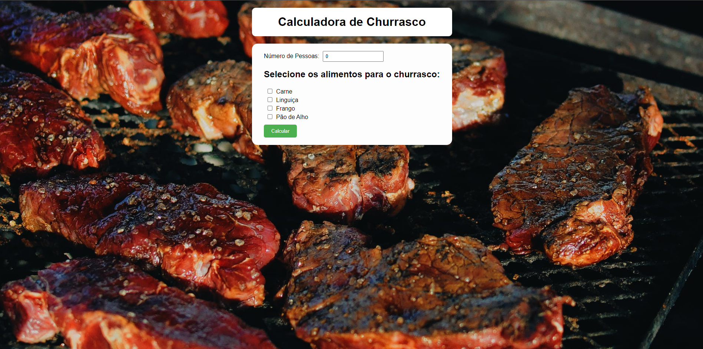

# Projeto de "Churrascometro"

## Descrição

O projeto tem como objetivo principal a prática de conceitos de lógica de programação e uso de bibliotecas utilitárias, como Formik para validação de dados, e uso de rotas com React Router. No projeto Churrascometro recebemos uma lista de alimentos, onde o usuário fornece o número de pessoas que irão consumir a refeição e recebe como retorno a página resultados informando a quantidade ideal de cada alimento para servir o número de pessoas citado.

## Funcionalidades

### Calculadora de Alimentos

* Fornece um campo de preenchimento numérico onde o usuário pode fornecer o número de convidados para a refeição.

* Disponibiliza uma lista de alimentos que o usuário pode selecionar para montar o seu cardápio de churrasco.

* Realiza os calculos baseado em uma quantidade recomendada para cada pessoa e retorna os resultados na página resultados.

Os jogadores devem fazer pares de cartões correspondentes.

### Validação de Dados

* Os dados precisam ser preenchidos corretamente para que a calculadora realize os calculos. Se os dados não forem preenchidos mensagens de erro aparecem para o usuário, instruindo o preenchimento correto dos campos.

### Botão Reiniciar

* Botão que reinicia o orçamento do churrasco.

## Tecnologias Utilizadas:

* Typescript
* JavaScript
* HTML
* CSS
* ReactJS (para componentização e manipulação do estado)
* Front-end (foco na interface do usuário)

## Imagens

### Calculadora

### Validação de Dados

### Página de Resultado

